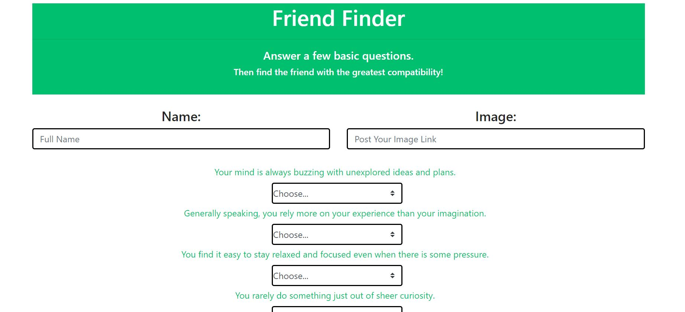

# Friend Finder - Node and Express Servers

In this application, I build a app which finds the best compatible friends. This application takes user input and based on those data, a compatible friend is searched and displayed.

### Technology Used
1. HTML, CSS, JavaScript, jQuery
2. Node Server
3. Express for routing
4. JS Modal Library
5. Heroku & GitHub for deployment

### Logic for the application
1. Two basic HTML page is created. The first is home page and the other is the survey page
2. APIroutes.js, htmlroute.js and server.js are used to handled the routing. The route for API and HTML are creaated on APIroute.js and HTMLroute.js. Module.exports is used to import those routes on server.js, which acts as the main server. Express is used for the routing.
3. Once the server is running, the user can navigate to the home and survey page. 
4. GET request allows the user to browse the page and POST request allows for the data to be posted, manipulated and provide the result.
5. A javascript modal library is used to display the compatible results.
